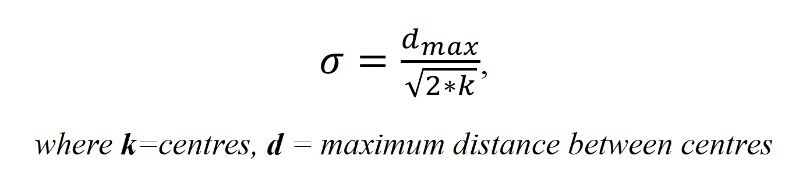
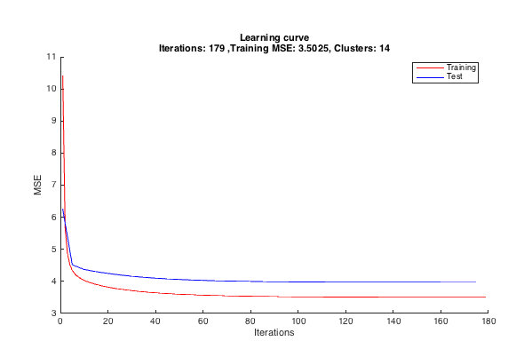
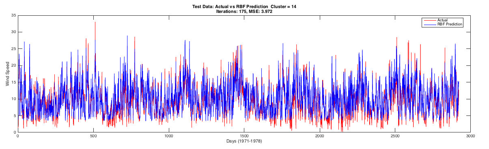

# Radial Basis Function Neural Network
Matlab implemetation of RBF network for prediction of wind speed in an unknown station. [Data](http://lib.stat.cmu.edu/datasets/wind.data) collected from 12 synoptic meteorological stations in the Republic of Ireland (Haslett and Raftery, Applied Statistics 1989). Description and data itself can be found from the following [link]( http://lib.stat.cmu.edu/datasets/wind.desc).

The clusters from data points is determided using kmeans.

The optimal number of clusters is determined by trying out different number of
cluster while observing the error performance. 3 – 100 cluster were tried out for this data, and 14 clusters showed a better learning performance as well as better error convergence on both the training and test data set.

Sigma is calculated using the formula: 

Model Training:
* Training set: Data from 1961-1970
* Test set: Data from 1971-1978 

Model Perfomance:

Actual vs Predicted

